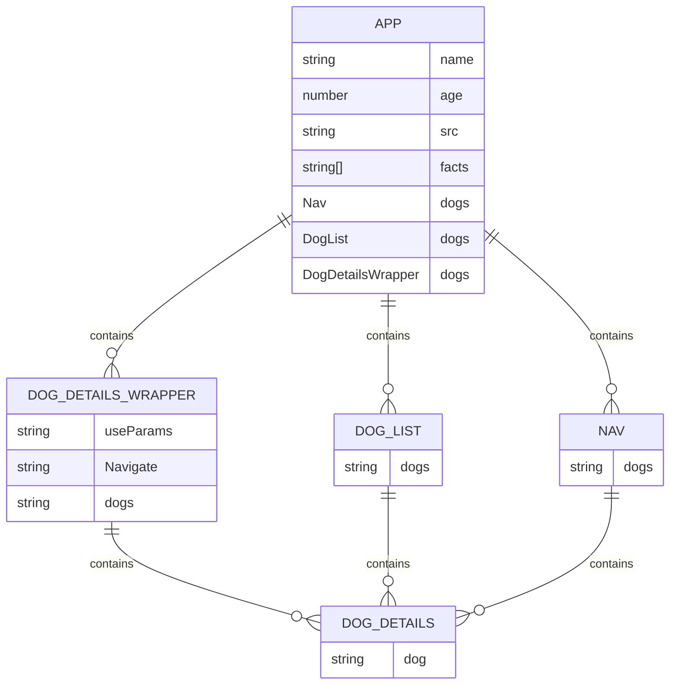

# Find Dogs to Adopt

## Description
This application is built with React and React Router. It allows users to find dogs available for adoption. Users can browse through a list of dogs, view details about each dog, and navigate through different sections of the application seamlessly.

## Features
- Browse a list of dogs available for adoption
- View detailed information about each dog
- Seamless navigation using React Router

## Installation
1. Clone the repository:
    ```sh
    git clone https://github.com/yourusername/find-dogs-to-adopt.git
    ```
2. Navigate to the project directory:
    ```sh
    cd find-dogs-to-adopt
    ```
3. Install dependencies:
    ```sh
    npm install
    ```

## Usage
1. Start the development server:
    ```sh
    npm start
    ```
2. Open your browser and navigate to `http://localhost:3000`

## Technologies Used
- React
- React Router
- CSS (or any other styling solution you used)

## Contributing
1. Fork the repository
2. Create a new branch (`git checkout -b feature-branch`)
3. Make your changes
4. Commit your changes (`git commit -m 'Add some feature'`)
5. Push to the branch (`git push origin feature-branch`)
6. Open a pull request

## Notes

### `package.json` --> "scripts"

I received the following error when I ran the command `npm start`:

```
haus@LAPTOP-S3QG7NKP:~/springboard_bootcamp_dec_2023/react-router-dogfinder$ npm start

> dogfinder@0.1.0 start
> concurrently --kill-others "npm run start-fe" "npm run start-be"

[0] 
[0] > dogfinder@0.1.0 start-fe
[0] > react-scripts start
[0] 
[1] 
[1] > dogfinder@0.1.0 start-be
[1] > json-server --watch db.json --delay 500 --port 5001
[1] 
[1] Unknown option '--delay'
[1] Usage: json-server [options] <file>
[1] 
[1] Options:
[1]   -p, --port <port>  Port (default: 3000)
[1]   -h, --host <host>  Host (default: localhost)
[1]   -s, --static <dir> Static files directory (multiple allowed)
[1]   --help             Show this message
[1]   --version          Show version number
[1] 
[1] npm run start-be exited with code 1
--> Sending SIGTERM to other processes..
[0] npm run start-fe exited with code SIGTERM
```

I changed the `package.json` file by removing the keywords `--delay 500` from the `"scripts": "start-be"` line of code.

original:
```
"scripts": {
    "start": "concurrently --kill-others \"npm run start-fe\" \"npm run start-be\"",
    "build": "react-scripts build",
    "test": "react-scripts test",
    "eject": "react-scripts eject",
    "start-fe": "react-scripts start",
    "start-be": "json-server --watch db.json --delay 500 --port 5001"
},
```

refactored:
```
"scripts": {
    "start": "concurrently --kill-others \"npm run start-fe\" \"npm run start-be\"",
    "build": "react-scripts build",
    "test": "react-scripts test",
    "eject": "react-scripts eject",
    "start-fe": "react-scripts start",
    "start-be": "json-server --watch db.json --port 5001"
},
```

### Component Hierarchy & Notes




#### `App.js`

**1. Purpose:**

The `App` component serves as the main entry point of the application. It sets up the routing for the application using `react-router-dom` and renders the `Nav` component along with the appropriate route components (`DogList` and `DogDetailsWrapper`).

**2. State Management:**

The `App` component does not manage any state. It receives a list of dogs as props and passes this data down to its child components.

**3. Props:**

- `dogs`: An array of dog objects, each containing `name`, `age`, `src`, and `facts`.

**4. Example Usage:**

```javascript
<App dogs={dogs} />
```

#### `Nav.js`

**1. Purpose:**

The `Nav` component renders a navigation bar with links to each dog's detail page. It uses the `Link` component from `react-router-dom` to create navigable links.

**2. State Management:**

The `Nav` component does not manage any state. It receives the list of dogs as props and maps over this list to create the navigation links.

**3. Props:**

- `dogs`: An array of dog objects, each containing `name`.

**4. Example Usage:**

```javascript
<Nav dogs={dogs} />
```

#### `DogList.js`

**1. Purpose:**

The `DogList` component renders a list of all dogs. Each dog's name is a link that navigates to the dog's detail page.

**2. State Management:**

The `DogList` component does not manage any state. It receives the list of dogs as props and maps over this list to create the links.

**3. Props:**

- `dogs`: An array of dog objects, each containing `name`.

**4. Example Usage:**

```javascript
<DogList dogs={dogs} />
```

#### `DogDetails.js`

**1. Purpose:**
   
The `DogDetails` component displays detailed information about a single dog, including its name, age, image, and facts.

**2. State Management:**

The `DogDetails` component does not manage any state. It receives a single dog object as a prop and renders its details.

**3. Props:**

- `dog`: An object containing `name`, `age`, `src`, and `facts`.

**4. Example Usage:**

```javascript
<DogDetails dog={dog} />
```

#### `DogDetailsWrapper.js`

**1. Purpose:**

The `DogDetailsWrapper` component acts as a wrapper to fetch the current dog based on the URL parameter and pass it to the `DogDetails` component. If the dog is not found, it redirects to the `/dogs` route.

**2. State Management:**

The `DogDetailsWrapper` component does not manage any state. It uses the `useParams` hook from `react-router-dom` to get the URL parameter and find the corresponding dog from the list of dogs passed as props.

**3. Props:**

- `dogs`: An array of dog objects, each containing `name`, `age`, `src`, and `facts`.

**4. Example Usage:**

```javascript
<DogDetailsWrapper dogs={dogs} />
```

## License
This project is licensed under the MIT License - see the [LICENSE](LICENSE) file for details.